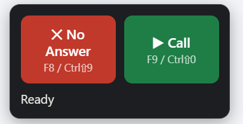

# Salesloft Dialer Hotkeys

Make cadence calling faster. Instead of clicking End Call, picking a disposition, and hitting Log & Complete for every no-answer, you press **one key** (or click one button) and it all happens for you.

<p align="center">
  
</p>

- 🔴 **The red button** — ends the call, logs it as "No Answer," completes the cadence step, and lines up the next person.
- 🟢 **The green button** — starts the next call.

That's it. Dial, no answer, red, green, repeat.

And before you dial, it checks the contact's page for you — if Salesloft already
has them tagged **Meeting Scheduled**, **Interested**, or **No Interest**, a
colour-coded alert says so, right next to the buttons.

---

## Installing (about 2 minutes)

You only have to do this once. The extension isn't in the Chrome Web Store, so Chrome needs you to load it manually — that's what these steps do.

### Step 1 — Download the folder

Click the green **Code** button at the top of this page, then **Download ZIP**. Open the downloaded file (Windows: right-click → **Extract All**; Mac: double-click) — you'll get a folder called `Salesloft-Dialer-Hotkeys-main`. Move that folder somewhere it can stay permanently — like your Documents folder.

> [!NOTE]
> Comfortable with git? `git clone https://github.com/gregfraser/Salesloft-Dialer-Hotkeys.git` gets you the same folder with nothing to extract.

> [!WARNING]
> Don't delete or move this folder later. Chrome runs the extension directly from it — if the folder goes in the trash, the extension stops working.

### Step 2 — Open Chrome's extensions page

In Chrome, type `chrome://extensions` into the address bar and press <kbd>Enter</kbd>.

### Step 3 — Turn on Developer mode

Look in the **top-right corner** of that page for a small toggle labeled **Developer mode**. Click it so it turns on.

> [!NOTE]
> This just allows Chrome to load extensions from a folder — it doesn't change anything else about your browser.

### Step 4 — Load the extension

Three new buttons will appear near the top-left. Click **Load unpacked**, then open the folder from Step 1 and select the **`extension`** folder inside it — the one with `manifest.json` in it — and click **Select Folder**.

> [!IMPORTANT]
> **Updating from version 1.1?** The extension files moved into an `extension` subfolder to make room for the transcription server. Chrome will not find them on its own: go to `chrome://extensions`, remove the old **Salesloft Dialer Hotkeys** card, and load it again pointing at the new `extension` folder. Your settings are kept.

### Step 5 — Pin it to your toolbar

Click the Extensions button (the puzzle-piece icon 🧩) to the right of Chrome's address bar, find **Salesloft Dialer Hotkeys** in the list, and click the pin 📌 next to it. Now its icon is always visible.

### Step 6 — Refresh Salesloft

If you already had Salesloft open, refresh that tab once. You should see the red and green buttons (pictured above) appear in the bottom-left corner of the page. You're done! 🎉

---

## Using it

Open Salesloft and start your cadence like normal. Then:

| You want to... | Press | Or click |
|---|---|---|
| Start the next call | <kbd>Ctrl</kbd>+<kbd>Shift</kbd>+<kbd>0</kbd> (Mac: <kbd>Cmd</kbd>+<kbd>Shift</kbd>+<kbd>0</kbd>) | 🟢 **▶ Call** |
| End the call, log "No Answer," move on | <kbd>Ctrl</kbd>+<kbd>Shift</kbd>+<kbd>9</kbd> (Mac: <kbd>Cmd</kbd>+<kbd>Shift</kbd>+<kbd>9</kbd>) | 🔴 **✕ No Answer** |

The keyboard shortcuts work **even when you're in a different tab** — reading a prospect's LinkedIn, checking ZoomInfo, whatever. The extension finds your Salesloft tab and does the work there.

If you're actually on the Salesloft tab, <kbd>F8</kbd> (red) and <kbd>F9</kbd> (green) also work as quick single-key versions.

The status line under the buttons (it says "Ready" in the picture above) tells you what's happening at each step — "Ending call…", "Logged No Answer ✓".

> [!TIP]
> Only use the red button for no-answers. If someone picks up, talk like normal and log that call yourself.

---

## Contact alerts

Nothing kills a call faster than dialing someone who already told your teammate
"not interested" — or who already has a meeting on the books. So the extension
reads the Disposition and Sentiment tags already on the contact's page and shows
a colour-coded alert before you dial — in the floating panel, and as a small
line inside the on-page buttons. Nothing pops up over the Salesloft page itself.

It reads the tags off the activity feed — the pills on a logged call or a booked
meeting — as well as any labelled Disposition/Sentiment field. Each tag keeps its
own colour, so you can read the situation at a glance:

| Tag | Colour | What it means |
|---|---|---|
| **Meeting Scheduled** | 🔵 Blue | Someone already booked this person. Don't cold-call them. |
| **Interested** | 🟢 Green | Warm. Worth a call, but not a cold one — read the notes first. |
| **No Interest** | 🔴 Red | They've said no. Check before you dial again. |

If more than one tag is on the page, every tag still shows in its own colour, and
the alert itself takes the colour of the most important one — blue first, then
red, then green.

The alert follows whoever is on screen: it updates when you move to the next
person in the cadence and disappears when their page is clean. The floating
panel and the on-page buttons show the same alert, so you see it whichever one
you work from — including from another tab.

> [!NOTE]
> This reads the page — it doesn't change anything and it never logs a call for
> you. It also ignores the Disposition dropdown you're filling in right now, so
> picking "No Interest" while logging a call won't set off an alert.

---

## Settings

Click the extension's icon in your toolbar to open settings:

| Setting | What it does |
|---|---|
| **Floating panel** | Puts the buttons in their own little window that you can drag anywhere — even a second monitor. It stays open while you work in other tabs. |
| **Buttons on Salesloft page** | Shows or hides the buttons in the corner of the Salesloft page. Turn off if you're using the floating panel or just the keyboard. |
| **Disposition** | The label the red button logs. Set to "No Answer." Only change this if your team's dropdown uses different wording — it must match the dropdown option in Salesloft **exactly**, including capitalization. |
| **Alert on tags** | Turns the contact alerts on or off. |
| **Tags to watch** | Which tags trigger an alert, comma separated. Starts with No Interest, Meeting Scheduled, Interested. Each one must match Salesloft's wording exactly. The coloured pills underneath show you what each tag will look like. |
| **Strict matching** | On by default: only counts a tag where Salesloft actually renders one — a pill on a logged call or meeting, a labelled Disposition/Sentiment field, or an activity table column. Keeps ordinary text like "we had a meeting scheduled last quarter" from setting it off. Turn it off only if your layout shows these tags somewhere unusual and you're not getting alerts. |
| **Edit shortcuts** | Opens Chrome's shortcut settings if <kbd>Ctrl</kbd>+<kbd>Shift</kbd>+<kbd>9</kbd>/<kbd>0</kbd> conflicts with something else or you'd prefer different keys. |
| **Live transcription** | Turns the transcript on, in the floating panel and beside the on-page buttons. Transcription then starts by itself as soon as a call is detected. Transcripts are saved only when you click the ↓ button — text only, never audio, and nothing is downloaded on its own. Needs the transcription server running — see below. |
| **Call audio output** | Which device you actually listen on. Get this wrong and the call plays somewhere you can't hear it. |


---

## Live transcription (optional)

Shows you what the prospect just said, as text, while you're still on the call.
It runs entirely on your own machine — no audio is recorded, saved, or sent
anywhere.

### One-time setup

You need Python 3.10 or newer installed. Then, from the folder you downloaded:

```powershell
powershell -ExecutionPolicy Bypass -File scripts\install.ps1
```

That takes a few minutes — it downloads the speech model so your first call
isn't spent waiting.

### Each day

Start the server before your call block and leave the window open:

```powershell
powershell -ExecutionPolicy Bypass -File scripts\start-server.ps1
```

Then turn on **Live transcription** in the extension settings. Click
**Test server** to confirm the two are talking to each other.

### Starting it on a call

Press <kbd>Ctrl</kbd>+<kbd>Shift</kbd>+<kbd>8</kbd> **while you're looking at the
Salesloft tab**.

That "while you're looking at the Salesloft tab" part matters. Chrome only lets
the extension listen to a tab you were actually on when you pressed the key — so
unlike the dial hotkeys, this one won't work from LinkedIn. Once it's started it
keeps going, and you can switch tabs freely for the rest of the call.

If you see **"Transcription not armed"**, that's what happened. Switch back to
Salesloft and press it again.

### Reading it

The transcript shows up in two places, and you can use either: the floating
panel, and a pane that appears beside the on-page buttons in the corner of the
Salesloft page. Both show the same words at the same time.

Scroll up to read something earlier and it stops auto-scrolling — a **↓ New
text** pill appears to tell you more has arrived. Scroll back to the bottom, or
click the pill, and it resumes. The buttons are pause, copy everything, save as
a text file, and clear.

The on-page pane keeps the last few calls, one after another with a divider
between them, so you can still look back at the previous conversation while
you're dialing the next person.

Nothing is saved to your computer unless you ask. When a call ends, whichever
transcript you're using says "Transcript ready — ↓ to save" and highlights the
save button; click it for the calls worth keeping and ignore it for the rest.
You'd be downloading a file for every no-answer otherwise.

> [!TIP]
> Treat the transcript as an aid, not a record of truth. Phone audio is
> compressed and speech recognition gets names, acronyms and numbers wrong more
> often than ordinary words — which is exactly the content worth double-checking
> before you read it back.

### If something looks wrong

[docs/troubleshooting.md](docs/troubleshooting.md) covers the common ones —
can't hear the prospect, "not armed", "offline", the transcript falling behind,
and lines appearing that were never said.

---

## For developers

- [docs/architecture.md](docs/architecture.md) — how the pieces fit together and why
- [docs/troubleshooting.md](docs/troubleshooting.md) — symptoms and fixes
- [CLAUDE.md](CLAUDE.md) — working in this codebase

Run the tests:

```bash
python -m pytest tests/                        # server, protocol, benchmark
node --test tests/test_salesloft_detection.js  # Salesloft DOM detection
node --test tests/test_pcm_worklet.js          # audio downsampling
node --test tests/test_transcript_format.js    # shared transcript formatting
```

---

## If something isn't working

<details>
<summary><strong>No buttons on the Salesloft page?</strong></summary>

Refresh the Salesloft tab. If they still don't appear, check that **Buttons on Salesloft page** is turned on in settings (click the extension icon).
</details>

<details>
<summary><strong>Pressed the shortcut and nothing happened?</strong></summary>

Make sure a Salesloft tab is actually open in Chrome. Then refresh that tab once and try again.
</details>

<details>
<summary><strong>The status line says "Stopped" or "Timed out"?</strong></summary>

The extension couldn't find a button it expected — this can happen if Salesloft is loading slowly or changed its screen layout. Just finish logging that one call by hand and keep going. If it happens on every call, tell whoever gave you this extension — Salesloft may have updated their site and the extension needs a small fix.
</details>

<details>
<summary><strong>It logged something with the wrong disposition?</strong></summary>

Check the **Disposition** field in settings — it must match your Salesloft dropdown word-for-word.
</details>

<details>
<summary><strong>Not seeing an alert on a contact you know is tagged?</strong></summary>

First make sure the version of the extension you loaded actually has this
feature — open settings (click the extension icon) and look for a **CONTACT
ALERTS** section. No section means you're running an older build — go to
`chrome://extensions` and reload it, making sure you pointed Chrome at the
**`extension`** folder (Step 4).

If the section is there, check that the tag in **Tags to watch** matches
Salesloft's wording exactly — "No Interest" and "Not Interested" are different
text. Failing that, try turning **Strict matching** off.
</details>

<details>
<summary><strong>Getting an alert that doesn't belong?</strong></summary>

Turn **Strict matching** back on — that's the setting that stops ordinary text
on the page from counting as a tag. If it's already on, narrow **Tags to watch**
to just the tags you care about.
</details>

<details>
<summary><strong>The extension disappeared after restarting your computer?</strong></summary>

The folder from Step 1 probably got moved or deleted. Put it back (or download it again — Step 1), go to `chrome://extensions`, and click **Load unpacked** again.
</details>

---

## Good to know

- The extension only runs on `app.salesloft.com`. It can't see or touch any other website.
- It doesn't store your calls, contacts, or any prospect data anywhere. It just clicks the same buttons you would click, faster.
- Contact alerts only read what's already on the page in front of you. Nothing about a contact is sent anywhere or saved.
- The red button never logs a call without setting the disposition first — if any step fails, it stops and tells you, rather than logging something half-finished.
- Transcription runs on your own machine. Audio is never recorded, never written to disk, and never sent over the internet — it exists in memory for a few seconds and is discarded. Transcript text is only saved when you click the save button — no call writes a file on its own.
- If transcription breaks, it goes quiet and the call carries on. It will never interrupt you mid-conversation with a popup.
