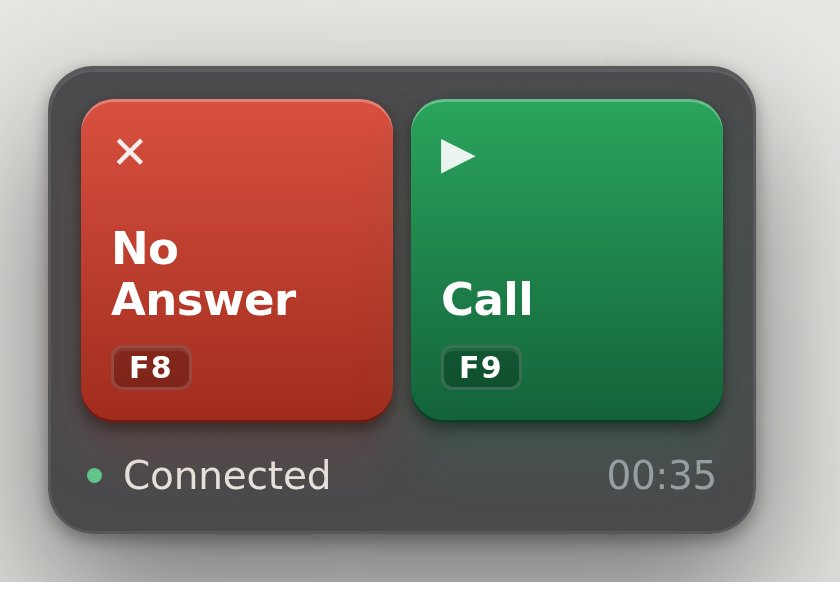

# Salesloft Dialer Hotkeys

Make cadence calling faster. Instead of clicking End Call, picking a disposition, and hitting Log & Complete for every no-answer, you press **one key** (or click one button) and it all happens for you.

<p align="center">
  
</p>

- 🔴 **The red button** — ends the call, logs it as "No Answer," completes the cadence step, and lines up the next person.
- 🟢 **The green button** — starts the next call.

That's it. Dial, no answer, red, green, repeat. Pick whichever keys suit you —
the number pad included — and the buttons show what you picked.

And before you dial, it checks the contact's page for you — if Salesloft already
has them tagged **Meeting Scheduled**, **Interested**, or **No Interest**, a
colour-coded alert says so, right above the buttons.

---

## Quick start

Three things, in this order. Each one links to the full steps.

| | Do this | Takes |
|---|---|---|
| **1** | [Install the extension](#installing) — download the folder, load it in Chrome | ~2 min, once |
| **2** | [Set your keys](#choosing-your-keys) — or keep <kbd>F8</kbd> and <kbd>F9</kbd> | ~1 min, once |
| **3** | [Dial](#using-it) — <kbd>F9</kbd> to call, <kbd>F8</kbd> to kill and log | every call |

Live transcription is optional and separate — it needs a small program running
on your own machine. [Set it up later](#live-transcription-optional), once
dialing works.

---

## Installing

You only have to do this once. The extension isn't in the Chrome Web Store, so
Chrome needs you to load it manually — that's what these steps do.

### Step 1 — Download the folder

1. Click the green **Code** button at the top of this page.
2. Click **Download ZIP**.
3. Open the downloaded file — Windows: right-click → **Extract All**; Mac: double-click.
4. You now have a folder called `Salesloft-Dialer-Hotkeys-main`. Move it somewhere permanent, like your Documents folder.

> [!WARNING]
> **Don't delete or move this folder later.** Chrome runs the extension directly
> from it — if the folder goes in the trash, the extension stops working.

> [!NOTE]
> Comfortable with git? `git clone https://github.com/gregfraser/Salesloft-Dialer-Hotkeys.git`
> gets you the same folder with nothing to extract.

### Step 2 — Open Chrome's extensions page

1. Click Chrome's address bar.
2. Type `chrome://extensions` and press <kbd>Enter</kbd>.

### Step 3 — Turn on Developer mode

1. Look in the **top-right corner** of that page.
2. Click the **Developer mode** toggle so it turns on.

> [!NOTE]
> This only lets Chrome load an extension from a folder. It changes nothing else
> about your browser.

### Step 4 — Load the extension

1. Three new buttons appear near the top-left. Click **Load unpacked**.
2. Open the folder from Step 1.
3. Go **into** it and select the folder named **`extension`** — the one containing `manifest.json`.
4. Click **Select Folder**.

✅ A card reading **Salesloft Dialer Hotkeys** should now be on the page.

> [!IMPORTANT]
> **Updating from version 1.1?** The extension files moved into an `extension`
> subfolder to make room for the transcription server, and Chrome will not find
> them on its own. Go to `chrome://extensions`, remove the old **Salesloft
> Dialer Hotkeys** card, and load it again pointing at the new `extension`
> folder. Your settings are kept.

### Step 5 — Pin it to your toolbar

1. Click the puzzle-piece icon 🧩 to the right of Chrome's address bar.
2. Find **Salesloft Dialer Hotkeys** in the list.
3. Click the pin 📌 next to it.

✅ Its icon is now always visible. That icon is how you open settings.

### Step 6 — Refresh Salesloft

1. If you already had Salesloft open, refresh that tab once.
2. Open any person's page.

✅ The red and green buttons (pictured above) appear in the bottom-left corner.
You're done! 🎉

> The buttons only show up where there's someone to dial — a contact's page, or
> any page with the call window open. You won't see them on your dashboard, a
> cadence, or the People list.

---

## Using it

Open Salesloft and start your cadence like normal. Then:

| You want to... | Press | Or click |
|---|---|---|
| Start the next call | <kbd>F9</kbd> | 🟢 **▶ Call** |
| End the call, log "No Answer," move on | <kbd>F8</kbd> | 🔴 **✕ No Answer** |

<kbd>F8</kbd> and <kbd>F9</kbd> are just where it starts — **you can change them to
any key you like, including the number pad.** Most reps end up on the pad, one
hand on it all day: see [Choosing your keys](#choosing-your-keys).

The buttons show the keys that are actually set, so you never have to remember
which is which — whatever you bind is printed right on them.

### Reading the plate

The dark slab the buttons sit on is the plate. Bottom to top:

| Part | What it tells you |
|---|---|
| **The line along the bottom** | What the extension is doing right now — "Ending call…", "Logged No Answer ✓". The dot at its left turns 🟢 green and it reads **Connected** while a call is up. |
| **The clock on the right** | How long you've been on this call. (With transcription on it moves up into the transcript header.) |
| **The two buttons** | Your two actions, with the key bound to each printed on it. |
| **A coloured band above them** | A [contact alert](#contact-alerts) — only appears when this person carries a tag worth knowing about. |

### Moving it

**Drag the plate anywhere on the page.** Grab it by its dark edge — anywhere
that isn't a button — and let go; it carries a little momentum and settles.
It won't go off screen, and it stays where you left it, on this computer, until
you move it again.

> [!TIP]
> Only use the red button for no-answers. If someone picks up, talk like normal
> and log that call yourself.

---

## Choosing your keys

1. Click the extension icon in your toolbar.
2. Look under **KEY BINDINGS**.
3. Click the key shown next to an action.
4. Press the key you want.

That's it — it saves straight away, and the button on the plate changes to match.

| | |
|---|---|
| **Any key works** | <kbd>F8</kbd>, <kbd>Num 1</kbd>, <kbd>Num +</kbd>, <kbd>Ctrl</kbd>+<kbd>K</kbd> — whatever your hand already rests on. Num Lock doesn't matter. |
| **Where they work** | On the Salesloft page, and in the floating panel if you use one. |
| **When they don't** | While you're typing in a box — so taking notes mid-call never dials anybody. |
| **Two keys, two jobs** | Give one action a key that already belongs to the other and it moves across; the row it came from shows "Not set" so you can see it went. |
| **Clearing one** | The small ✕ next to it. The button and Chrome's shortcut still work. |

### Dialing from another tab

Reading a prospect's LinkedIn or checking ZoomInfo? Chrome can run the same two
jobs from anywhere, using shortcuts of its own — by default
<kbd>Ctrl</kbd>+<kbd>Shift</kbd>+<kbd>9</kbd> (red) and
<kbd>Ctrl</kbd>+<kbd>Shift</kbd>+<kbd>0</kbd> (green). The extension finds your
Salesloft tab and does the work there.

Those are Chrome's, not the extension's, and Chrome has rules about them: no
number pad, and if another extension already uses the combination Chrome quietly
leaves it **unset**. The settings popup lists what Chrome actually has right
now, and the **Chrome shortcuts** button at the bottom opens the page where you
can change them.

---

## Contact alerts

Nothing kills a call faster than dialing someone who already told your teammate
"not interested" — or who already has a meeting on the books. So the extension
reads the Disposition and Sentiment tags already on the contact's page and shows
a colour-coded alert before you dial — in the floating panel, and as a band that
opens above the buttons on the page. Nothing pops up over Salesloft itself.

It reads the tags off the activity feed — the pills on a logged call or a booked
meeting — as well as any labelled Disposition/Sentiment field. Each tag keeps its
own colour, so you can read the situation at a glance:

| Tag | Colour | What it means |
|---|---|---|
| **Meeting Scheduled** | 🔵 Blue | Someone already booked this person. Don't cold-call them. |
| **Interested** | 🟢 Green | Warm. Worth a call, but not a cold one — read the notes first. |
| **No Interest** | 🔴 Red | They've said no. Check before you dial again. |

The alert shows the tag itself in its colour and nothing else — no wording of
its own in front of it.

If more than one tag is on the page, every tag still shows in its own colour, and
the alert itself takes the colour of the most important one — blue first, then
red, then green.

The alert follows whoever is on screen: it opens when you move to a person who
has a tag, and closes again when their page is clean. The floating panel and the
on-page plate show the same alert, so you see it whichever one you work from —
including from another tab.

> [!NOTE]
> This reads the page — it doesn't change anything and it never logs a call for
> you. It also ignores the Disposition dropdown you're filling in right now, so
> picking "No Interest" while logging a call won't set off an alert.

---

## Settings

Click the extension's icon in your toolbar to open settings:

| Setting | What it does |
|---|---|
| **Floating panel** | Puts the buttons in their own little window that you can drag anywhere — even a second monitor. It stays open while you work in other tabs. |
| **Buttons on Salesloft page** | Shows or hides the plate in the corner of a contact's page. Turn off if you're using the floating panel or just the keyboard. |
| **Disposition** | The label the red button logs. Set to "No Answer." Only change this if your team's dropdown uses different wording — it must match the dropdown option in Salesloft **exactly**, including capitalization. |
| **Alert on tags** | Turns the contact alerts on or off. |
| **Tags to watch** | Which tags trigger an alert, comma separated. Starts with No Interest, Meeting Scheduled, Interested. Each one must match Salesloft's wording exactly. The coloured pills underneath show you what each tag will look like. |
| **Strict matching** | On by default: only counts a tag where Salesloft actually renders one — a pill on a logged call or meeting, a labelled Disposition/Sentiment field, or an activity table column. Keeps ordinary text like "we had a meeting scheduled last quarter" from setting it off. Turn it off only if your layout shows these tags somewhere unusual and you're not getting alerts. |
| **Key bindings** | The key for each button — press the one you want, number pad included. See [Choosing your keys](#choosing-your-keys). |
| **Chrome shortcuts** | Opens Chrome's own shortcut page, for the combinations that work from another tab. |
| **Live transcription** | Turns the transcript on, in the floating panel and beside the on-page buttons. Transcription then starts by itself as soon as a call is detected. Transcripts are saved only when you click the ↓ button — text only, never audio, and nothing is downloaded on its own. Needs the transcription server running — see below. |
| **Call audio output** | Which device you actually listen on. Get this wrong and the call plays somewhere you can't hear it. |

---

## Live transcription (optional)

Shows you what the prospect just said, as text, while you're still on the call.
It runs entirely on your own machine — no audio is recorded, saved, or sent
anywhere.

### Set it up (once)

**Step 1 — Install Python.** You need version 3.10 or newer, from
[python.org](https://www.python.org/downloads/). On the **first screen** of the
installer, tick **Add python.exe to PATH** before clicking Install.

**Step 2 — Run the installer.** Open the folder you downloaded in
[Step 1](#step-1--download-the-folder) and **double-click `Install.cmd`**.

**Step 3 — Wait for it.** It takes a few minutes, mostly downloading the speech
model so your first call isn't spent waiting. When it says **"Setup complete"**,
close the window.

✅ If anything goes wrong it stops and tells you what happened — the **Setup**
section of [docs/troubleshooting.md](docs/troubleshooting.md) covers the common
ones.

### Start it (each day)

**Step 1 — Start the server.** Double-click **`Start Server.cmd`** before your
call block and **leave that window open**. Closing it turns transcription off.

**Step 2 — Turn it on.** Click the extension icon and switch on **Live
transcription**.

**Step 3 — Check it.** Click **Test server**. It should confirm the two are
talking to each other.

> [!TIP]
> Tired of remembering? **Double-click `Auto-start.cmd`** and the server starts
> by itself, minimised, every time you log in. Double-click it again to switch
> that back off. The catch: the server keeps the speech model loaded — about a
> gigabyte of memory — from login until you close it. That's what makes the
> first call of the day as fast as the rest.

<details>
<summary>Prefer the command line?</summary>

```powershell
powershell -ExecutionPolicy Bypass -File scripts\install.ps1
powershell -ExecutionPolicy Bypass -File scripts\start-server.ps1
powershell -ExecutionPolicy Bypass -File scripts\autostart.ps1 -Enable
```

The `.cmd` files do exactly this and nothing more.
</details>

### Start it on a call

1. Click the **Salesloft tab** so you're looking at it.
2. Press <kbd>Ctrl</kbd>+<kbd>Shift</kbd>+<kbd>8</kbd>.

That "looking at the Salesloft tab" part matters. Chrome only lets the extension
listen to a tab you were actually on when you pressed the key — so unlike
Chrome's dial shortcuts, this one won't work from LinkedIn. Once it's started it
keeps going, and you can switch tabs freely for the rest of the call.

This one has to be a Chrome shortcut for the same reason, so it can't be a
number pad key and Chrome may have left it unset. The settings popup lists what
Chrome actually has.

If you see **"Transcription not armed"**, that's what happened. Switch back to
Salesloft and press it again.

### Read it

The transcript shows up in two places, and you can use either: the floating
panel, and a pane that appears beside the buttons on the Salesloft page. Both
show the same words at the same time.

Along the top of the pane: a light and the word **LIVE** while it's listening,
the call clock, and three buttons.

| Button | What it does |
|---|---|
| **«** | Folds the pane away. **»** brings it back. |
| **⏸** | Pauses transcription. Press again to resume. |
| **↓** | Saves what's there as a text file. |

The floating panel has those plus **⧉** to copy everything and **✕** to clear.

Scroll up to read something earlier and it stops auto-scrolling — a **↓ New
text** pill appears to tell you more has arrived. Scroll back to the bottom, or
click the pill, and it resumes.

Folding the pane away (**«**) leaves that top strip behind, so the corner of the
page is just the two dialer buttons and a strip. Transcription keeps running
while it's folded — the light stays lit and nothing you've captured is lost.

The on-page pane keeps the last few calls, one after another with a divider
between them, so you can still look back at the previous conversation while
you're dialing the next person.

Nothing is saved to your computer unless you ask. When a call ends, whichever
transcript you're using says "Transcript ready — ↓ to save" and highlights the
save button; click it for the calls worth keeping and ignore it for the rest.
You'd be downloading a file for every no-answer otherwise.

> [!TIP]
> Treat the transcript as an aid, not a record of truth. Phone audio is
> compressed and speech recognition gets names, acronyms and numbers wrong more
> often than ordinary words — which is exactly the content worth double-checking
> before you read it back.

### If something looks wrong

[docs/troubleshooting.md](docs/troubleshooting.md) covers the common ones —
can't hear the prospect, "not armed", "offline", the transcript falling behind,
and lines appearing that were never said.

---

## If something isn't working

<details>
<summary><strong>No buttons on the Salesloft page?</strong></summary>

1. Check you're on a **person's page** — the plate stays out of the way everywhere else (your dashboard, a cadence, the People list).
2. Refresh the Salesloft tab.
3. Click the extension icon and check **Buttons on Salesloft page** is on.
</details>

<details>
<summary><strong>Can't find the buttons — did they move?</strong></summary>

The plate remembers wherever you last dragged it, so it may not be in the
bottom-left corner any more. It's always fully on screen somewhere; scan the
edges of the Salesloft tab, then drag it back where you want it.
</details>

<details>
<summary><strong>Pressed the key and nothing happened?</strong></summary>

1. Make sure a Salesloft tab is actually open in Chrome.
2. Refresh that tab once and try again.
3. Look at the button: whatever key is bound is printed right on it. Blank means that action has no key.

Remember those keys work on the Salesloft page and in the floating panel — from
another tab it's Chrome's shortcut that does it, and Chrome leaves a shortcut
unset when another extension already uses that combination. The settings popup
lists what Chrome has.
</details>

<details>
<summary><strong>The status line says "Stopped" or "Timed out"?</strong></summary>

The extension couldn't find a button it expected — this can happen if Salesloft
is loading slowly or changed its screen layout. Finish logging that one call by
hand and keep going. If it happens on every call, tell whoever gave you this
extension — Salesloft may have updated their site and the extension needs a
small fix.
</details>

<details>
<summary><strong>It logged something with the wrong disposition?</strong></summary>

Check the **Disposition** field in settings — it must match your Salesloft
dropdown word-for-word.
</details>

<details>
<summary><strong>Not seeing an alert on a contact you know is tagged?</strong></summary>

1. Open settings (click the extension icon) and look for a **CONTACT ALERTS** section. No section means you're running an older build — go to `chrome://extensions` and reload it, making sure you pointed Chrome at the **`extension`** folder ([Step 4](#step-4--load-the-extension)).
2. Check the tag in **Tags to watch** matches Salesloft's wording exactly — "No Interest" and "Not Interested" are different text.
3. Still nothing? Try turning **Strict matching** off.
</details>

<details>
<summary><strong>Getting an alert that doesn't belong?</strong></summary>

Turn **Strict matching** back on — that's the setting that stops ordinary text
on the page from counting as a tag. If it's already on, narrow **Tags to watch**
to just the tags you care about.
</details>

<details>
<summary><strong>The extension disappeared after restarting your computer?</strong></summary>

The folder from Step 1 probably got moved or deleted. Put it back (or download
it again — [Step 1](#step-1--download-the-folder)), go to `chrome://extensions`,
and click **Load unpacked** again.
</details>

---

## Good to know

- The extension only runs on `app.salesloft.com`. It can't see or touch any other website.
- It doesn't store your calls, contacts, or any prospect data anywhere. It just clicks the same buttons you would click, faster.
- Contact alerts only read what's already on the page in front of you. Nothing about a contact is sent anywhere or saved.
- Where you dragged the plate is remembered on that computer only — not synced to your other machines, and not sent anywhere.
- The red button never logs a call without setting the disposition first — if any step fails, it stops and tells you, rather than logging something half-finished.
- Transcription runs on your own machine. Audio is never recorded, never written to disk, and never sent over the internet — it exists in memory for a few seconds and is discarded. Transcript text is only saved when you click the save button — no call writes a file on its own.
- If transcription breaks, it goes quiet and the call carries on. It will never interrupt you mid-conversation with a popup.

---

## For developers

- [docs/architecture.md](docs/architecture.md) — how the pieces fit together and why
- [docs/troubleshooting.md](docs/troubleshooting.md) — symptoms and fixes
- [CLAUDE.md](CLAUDE.md) — working in this codebase

Run the tests:

```bash
python -m pytest tests/                        # server, protocol, benchmark
node --test tests/test_salesloft_detection.js  # Salesloft DOM detection
node --test tests/test_hotkeys.js              # key bindings
node --test tests/test_pcm_worklet.js          # audio downsampling
node --test tests/test_transcript_format.js    # shared transcript formatting
node --test tests/test_contact_page.js         # which routes are a contact
node --test tests/test_contact_alert.js        # tag matching
```
